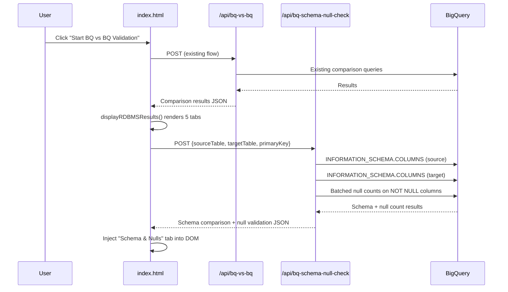

# Design Document: BQ Schema-Aware Null Check

## Overview

This feature adds a schema-aware null check to the BQ vs BQ validation flow. It introduces a new backend endpoint (`/api/bq-schema-null-check`) that reads full schema metadata (`column_name`, `data_type`, `is_nullable`) from `INFORMATION_SCHEMA.COLUMNS` for both source and target BigQuery tables, compares schema properties, identifies NOT NULL columns in the source, and runs targeted null count queries on those columns in the target. Results are displayed in a new "Schema & Nulls" tab injected into the existing BQ vs BQ results view after `displayRDBMSResults` renders, without modifying any existing functions or endpoints.

### Key Design Decisions

1. **Separate endpoint** (`/api/bq-schema-null-check`): Keeps existing `/api/bq-vs-bq` and `/api/bq-null-check` untouched. The new endpoint is called client-side after the main comparison completes.
2. **DOM injection pattern**: The new tab is appended to the DOM after `displayRDBMSResults` renders, rather than modifying that function. This uses `querySelector` to find the existing tab navigation and content containers and append new elements.
3. **Batched null count queries**: Instead of one query per column, null counts are batched into a single `SELECT` with multiple `COUNTIF(column IS NULL)` expressions, reducing BigQuery API calls.
4. **Reuse of existing BigQuery client**: The endpoint uses the same `bigquery` instance already initialized in `server.js`.

## Architecture

The feature follows the existing architecture pattern: Express endpoint in `server.js` → BigQuery queries → JSON response → frontend JavaScript renders HTML into the DOM.



## Components and Interfaces

### Backend: `/api/bq-schema-null-check` Endpoint

**Location:** `server.js` (new `app.post` route, placed after the existing `/api/bq-vs-bq` endpoint)

**Request Body:**
```json
{
  "sourceTable": "project.dataset.table",
  "targetTable": "project.dataset.table",
  "primaryKey": "column_name"
}
```

**Validation:**
- All three fields required
- `sourceTable` and `targetTable` must match `/^[\w-]+\.[\w-]+\.[\w-]+$/`

**Processing Steps:**
1. Query `INFORMATION_SCHEMA.COLUMNS` for source table: `SELECT column_name, data_type, is_nullable FROM \`project.dataset\`.INFORMATION_SCHEMA.COLUMNS WHERE table_name = 'table'`
2. Query `INFORMATION_SCHEMA.COLUMNS` for target table (same pattern)
3. Build per-column comparison (type match, nullability match, source-only, target-only)
4. Identify NOT NULL columns: source columns where `is_nullable = 'NO'`, plus the primary key column regardless
5. Run batched null count query on target: `SELECT COUNT(*) as total_rows, COUNTIF(col1 IS NULL) as null_col1, COUNTIF(col2 IS NULL) as null_col2, ... FROM \`target_table\``
6. Build per-column validation results with PASS/FAIL status

**Response Body:**
```json
{
  "success": true,
  "data": {
    "schemaComparison": {
      "columns": [
        {
          "columnName": "id",
          "sourceDataType": "INT64",
          "targetDataType": "INT64",
          "dataTypeMatch": true,
          "sourceNullable": "NO",
          "targetNullable": "YES",
          "nullableMatch": false,
          "status": "both"
        }
      ],
      "summary": {
        "totalColumnsCompared": 20,
        "dataTypeMismatches": 2,
        "nullabilityMismatches": 3,
        "sourceOnlyColumns": 1,
        "targetOnlyColumns": 0
      }
    },
    "nullValidation": {
      "notNullColumns": ["id", "name", "created_at"],
      "results": [
        {
          "columnName": "id",
          "totalRows": 50000,
          "nullCount": 0,
          "nonNullCount": 50000,
          "nullPercentage": "0.00",
          "status": "PASS"
        }
      ],
      "summary": {
        "totalColumnsValidated": 3,
        "columnsPassed": 2,
        "columnsFailed": 1,
        "passRate": "66.7"
      }
    },
    "metadata": {
      "sourceTable": "project.dataset.source_table",
      "targetTable": "project.dataset.target_table",
      "primaryKey": "id",
      "checkedAt": "2024-01-15T10:30:00.000Z"
    }
  }
}
```

**Error Response:**
```json
{
  "success": false,
  "error": "Failed to read schema for source table project.dataset.table: <message>"
}
```

### Frontend: Tab Injection Function

**Function:** `injectSchemaNullTab(schemaNullData, dbType)` — added to `public/index.html`

**Behavior:**
1. Finds the existing `.results-navigation-tabs` container within the BQ results section
2. Appends a new tab button: `<button class="results-tab-button" onclick="switchRdbmsTab('bigquery', 'schema-nulls')">🔎 Schema & Nulls</button>`
3. Finds the inner content wrapper (the `div` that contains `rdbms-tab-bigquery-record-count` etc.)
4. Appends a new content div with ID `rdbms-tab-bigquery-schema-nulls`, initially hidden (`display: none`)
5. Populates the content div with summary cards, schema comparison table, and null validation table

**Function:** `callSchemaNullCheck(sourceTable, targetTable, primaryKey, dbType)` — added to `public/index.html`

**Behavior:**
1. Calls `fetch('/api/bq-schema-null-check', ...)` with POST
2. On success, calls `injectSchemaNullTab(data, dbType)`
3. On failure, injects the tab with an error message inside

### Integration Point in `startBQvsBQComparison()`

After `displayRDBMSResults` is called (single-table case) or after `displayMultiTableResults` (multi-table case), the function calls `callSchemaNullCheck()` with the table metadata from the completed comparison.

For multi-table: the schema-null-check is called per table when the user clicks "View Detailed Results" for that table, since `displayRDBMSResults` is called at that point.

## Data Models

### Schema Column Comparison Object
```
{
  columnName: string,
  sourceDataType: string | null,     // null if target-only
  targetDataType: string | null,     // null if source-only
  dataTypeMatch: boolean,
  sourceNullable: string | null,     // "YES" | "NO" | null
  targetNullable: string | null,     // "YES" | "NO" | null
  nullableMatch: boolean,
  status: "both" | "source_only" | "target_only"
}
```

### Null Validation Result Object
```
{
  columnName: string,
  totalRows: number,
  nullCount: number,
  nonNullCount: number,
  nullPercentage: string,           // e.g. "0.05"
  status: "PASS" | "FAIL"
}
```

### Null Validation Summary Object
```
{
  totalColumnsValidated: number,
  columnsPassed: number,
  columnsFailed: number,
  passRate: string                  // e.g. "95.0"
}
```


## Correctness Properties

*A property is a characteristic or behavior that should hold true across all valid executions of a system — essentially, a formal statement about what the system should do. Properties serve as the bridge between human-readable specifications and machine-verifiable correctness guarantees.*

### Property 1: Schema comparison correctly classifies columns

*For any* two sets of schema columns (source and target), the comparison function should produce a result where: every source column appears in the output, every target column appears in the output, columns present in both are marked `"both"` with correct `dataTypeMatch` and `nullableMatch` booleans, columns only in source are marked `"source_only"` with null target fields, and columns only in target are marked `"target_only"` with null source fields.

**Validates: Requirements 2.1, 2.2, 2.3**

### Property 2: Schema comparison summary is consistent with detailed results

*For any* schema comparison result, the `summary.totalColumnsCompared` should equal the length of the `columns` array, `summary.dataTypeMismatches` should equal the count of columns where `dataTypeMatch` is false and `status` is `"both"`, and `summary.nullabilityMismatches` should equal the count of columns where `nullableMatch` is false and `status` is `"both"`.

**Validates: Requirements 2.4**

### Property 3: NOT NULL column identification includes all source NOT NULL columns plus primary key

*For any* source schema and primary key value, the identified NOT NULL columns list should contain exactly the set of columns where `is_nullable` equals `'NO'`, plus the primary key column (even if its `is_nullable` is `'YES'`), with no duplicates.

**Validates: Requirements 3.1, 3.2, 3.3**

### Property 4: Null validation status is PASS if and only if null count is zero

*For any* null validation result entry, the `status` field should be `"PASS"` when `nullCount` equals 0, and `"FAIL"` when `nullCount` is greater than 0. Additionally, `nonNullCount` should equal `totalRows - nullCount`, and `nullPercentage` should equal `(nullCount / totalRows * 100)` formatted to two decimal places.

**Validates: Requirements 4.3, 4.4**

### Property 5: Null validation summary is consistent with detailed results

*For any* null validation result set, `summary.totalColumnsValidated` should equal the length of the `results` array, `summary.columnsPassed` should equal the count of results with `status` `"PASS"`, `summary.columnsFailed` should equal the count of results with `status` `"FAIL"`, and `summary.passRate` should equal `(columnsPassed / totalColumnsValidated * 100)` formatted to one decimal place.

**Validates: Requirements 4.5**

### Property 6: Input validation rejects requests with missing or malformed parameters

*For any* request body where `sourceTable`, `targetTable`, or `primaryKey` is missing, or where `sourceTable` or `targetTable` does not match the `project.dataset.table` format, the endpoint should return a non-success response with an error message.

**Validates: Requirements 5.2, 5.3**

### Property 7: Rendered tab HTML contains all required data fields

*For any* valid schema-null-check response data, the HTML generated by the rendering function should contain: every column name from the schema comparison, every source and target data type, every match status indicator, every null count value, every pass/fail status, and all summary card values (total checked, passed, failed, pass rate).

**Validates: Requirements 6.3, 6.4, 6.5**

## Error Handling

### Backend Errors

| Error Scenario | Response | HTTP Status |
|---|---|---|
| Missing required field (`sourceTable`, `targetTable`, or `primaryKey`) | `{ success: false, error: "sourceTable, targetTable, and primaryKey are required" }` | 400 |
| Invalid table format | `{ success: false, error: "Invalid source/target table format: <value>. Must be project.dataset.table" }` | 400 |
| Source schema query fails | `{ success: false, error: "Failed to read schema for source table <table>: <message>" }` | 400 |
| Target schema query fails | `{ success: false, error: "Failed to read schema for target table <table>: <message>" }` | 400 |
| Null count query fails | `{ success: false, error: "Null count query failed: <message>" }` | 500 |
| Unexpected server error | `{ success: false, error: "<message>" }` | 500 |

### Frontend Error Handling

- If the `/api/bq-schema-null-check` call fails (network error or non-success response), the "Schema & Nulls" tab is still injected but displays an error message: "Schema & Null check failed: <error>. The other validation results are unaffected."
- The existing 5 tabs are never affected by schema-null-check failures since the tab is injected after they are already rendered.

## Testing Strategy

### Testing Framework

Since the project has no existing test framework, tests will use:
- **Jest** for the test runner
- **fast-check** for property-based testing

Install: `npm install --save-dev jest fast-check`

### Unit Tests

Unit tests cover specific examples and edge cases:
- Schema query returns expected structure for a known table mock
- Error response includes table name when schema query throws
- Empty source schema (no columns) produces empty comparison
- Primary key with `is_nullable = 'YES'` is still included in NOT NULL list
- Zero NOT NULL columns produces empty validation results
- Table format validation rejects strings like `"just_a_table"`, `"project.dataset"`, `""`, etc.
- Tab injection creates element with correct ID `rdbms-tab-bigquery-schema-nulls`
- Tab injection does not remove or modify existing tab elements

### Property-Based Tests

Each property test runs a minimum of 100 iterations. Each test is tagged with a comment referencing the design property.

- **Feature: bq-schema-aware-null-check, Property 1: Schema comparison correctly classifies columns** — Generate random source and target column arrays, run comparison, verify classification.
- **Feature: bq-schema-aware-null-check, Property 2: Schema comparison summary is consistent with detailed results** — Generate random comparison results, compute summary, verify counts match.
- **Feature: bq-schema-aware-null-check, Property 3: NOT NULL column identification includes all source NOT NULL columns plus primary key** — Generate random schemas with varying `is_nullable` values and random primary key, verify the NOT NULL list.
- **Feature: bq-schema-aware-null-check, Property 4: Null validation status is PASS if and only if null count is zero** — Generate random null count values, compute status, verify PASS/FAIL correctness and arithmetic.
- **Feature: bq-schema-aware-null-check, Property 5: Null validation summary is consistent with detailed results** — Generate random arrays of validation results, compute summary, verify consistency.
- **Feature: bq-schema-aware-null-check, Property 6: Input validation rejects requests with missing or malformed parameters** — Generate random request bodies with missing fields or malformed table strings, verify rejection.
- **Feature: bq-schema-aware-null-check, Property 7: Rendered tab HTML contains all required data fields** — Generate random response data, render HTML string, verify all data values appear in the output.

### Test Organization

```
tests/
  schema-null-check/
    schema-comparison.test.js      # Properties 1, 2 + unit tests
    not-null-identification.test.js # Property 3 + unit tests
    null-validation.test.js         # Properties 4, 5 + unit tests
    input-validation.test.js        # Property 6 + unit tests
    tab-rendering.test.js           # Property 7 + unit tests
```

Each property-based test must be implemented as a single `fc.assert(fc.property(...))` call with `{ numRuns: 100 }` configuration.
