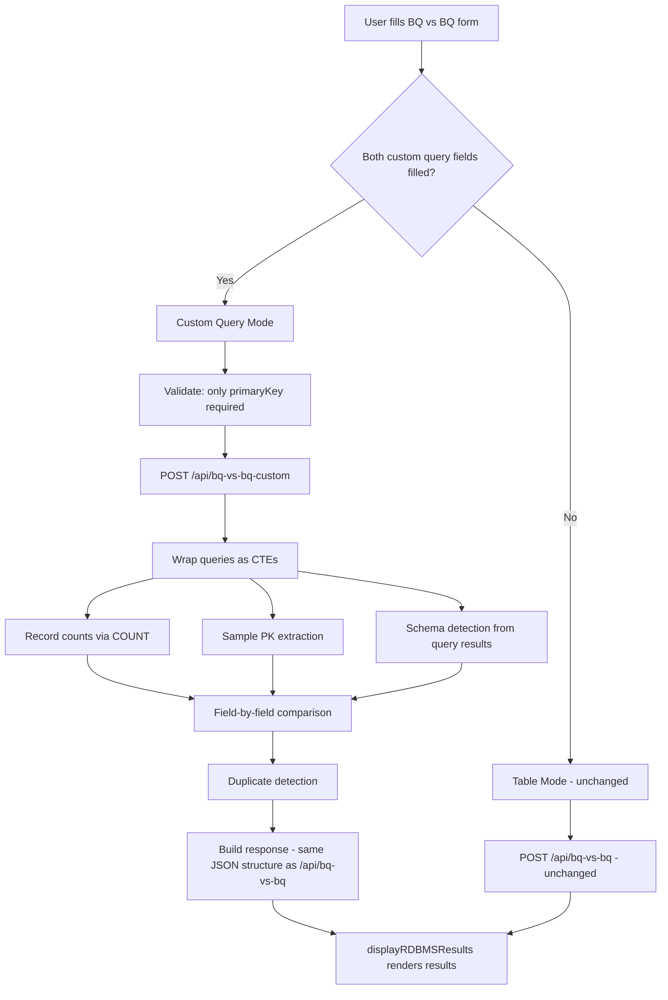

# Design Document: BQ vs BQ Custom Query

## Overview

This feature extends the existing BQ vs BQ comparison tab with optional custom SQL query support. Instead of only comparing full tables by dataset + table name, users can provide arbitrary BigQuery SQL queries for both source and target, and the system compares the query results using the same comparison pipeline.

The design follows the existing PostgreSQL custom query pattern conceptually but is simpler since both source and target are BigQuery — no RDBMS connection is needed. The backend wraps user-provided queries as CTEs (Common Table Expressions) and runs the same comparison logic (record counts, sample-based matching, field-by-field comparison, duplicate detection) against the CTE results.

Key design decisions:
- **CTE-based approach** over temp tables: avoids DDL permissions, cleanup concerns, and race conditions. The user queries become `WITH source_cte AS (<user query>), target_cte AS (<user query>)` and all comparison SQL references the CTEs instead of table names.
- **Dedicated endpoint** (`/api/bq-vs-bq-custom`): keeps the existing `/api/bq-vs-bq` endpoint completely untouched.
- **Same response structure**: the new endpoint returns the identical JSON shape so `displayRDBMSResults` renders it without modification.

## Architecture



## Components and Interfaces

### Frontend Components

**1. Source Custom Query Textarea**
- HTML id: `bqvsbq-source-custom-query`
- Positioned after the source filter field in the left panel
- Monospace font, vertically resizable
- Label: "Source Custom Query (Optional)"

**2. Target Custom Query Textarea**
- HTML id: `bqvsbq-target-custom-query`
- Positioned after comparison fields input, before the start button in the right panel
- Monospace font, vertically resizable
- Label: "Target Custom Query (Optional)"

**3. Modified `startBQvsBQComparison()` function**
- At the top, reads both custom query fields
- Detects custom query mode: `isCustomQueryMode = !!(sourceCustomQuery && targetCustomQuery)`
- In custom mode:
  - Skips dataset/table validation
  - Requires only primary key
  - Calls `/api/bq-vs-bq-custom` instead of `/api/bq-vs-bq`
  - Shows loading message: "Running Custom Query Comparison..."
- In table mode: unchanged behavior

### Backend Components

**4. `/api/bq-vs-bq-custom` endpoint (server.js)**
- Placed after the existing `/api/bq-vs-bq` endpoint
- Request body: `{ sourceQuery, targetQuery, primaryKey, comparisonFields }`
- Validation: returns 400 if sourceQuery, targetQuery, or primaryKey missing
- Uses CTE approach to wrap user queries
- Comparison steps mirror `/api/bq-vs-bq`:
  1. Record counts (COUNT on each CTE)
  2. Sample PK extraction (LIMIT 2000 distinct PKs from source CTE)
  3. Schema detection (SELECT * LIMIT 1 from each CTE, extract field names from result)
  4. Field-by-field comparison on matched sample records
  5. Duplicate PK detection
- Returns identical JSON structure to `/api/bq-vs-bq`

### API Interface

**POST `/api/bq-vs-bq-custom`**

Request:
```json
{
  "sourceQuery": "SELECT * FROM `project.dataset.table` WHERE created_date >= '2024-01-01'",
  "targetQuery": "SELECT * FROM `project.dataset.other_table` WHERE status = 'ACTIVE'",
  "primaryKey": "record_id",
  "comparisonFields": ["field1", "field2"]
}
```

Response: Same structure as `/api/bq-vs-bq` — `{ success, data: { summary, recordCounts, schemaAnalysis, fieldWiseAnalysis, duplicatesAnalysis, metadata } }`

Error Response (400):
```json
{
  "success": false,
  "error": "Source query failed: Syntax error in SQL query at [1:15]",
  "suggestions": ["Check SQL syntax", "Verify table references", "Ensure query returns results"]
}
```

## Data Models

### Request Model — `/api/bq-vs-bq-custom`

| Field | Type | Required | Description |
|-------|------|----------|-------------|
| `sourceQuery` | string | Yes | Arbitrary BigQuery SQL for source data |
| `targetQuery` | string | Yes | Arbitrary BigQuery SQL for target data |
| `primaryKey` | string | Yes | Column name to join source and target records |
| `comparisonFields` | string[] | No | Specific fields to compare; empty = all common fields except PK |

### Response Model

The response is identical to the existing `/api/bq-vs-bq` endpoint. Key differences in `metadata`:

| Field | Value |
|-------|-------|
| `sourceType` | `'BIGQUERY_CUSTOM_QUERY'` |
| `sourceTable` | The source SQL query text (truncated for display) |
| `targetTable` | The target SQL query text (truncated for display) |
| `comparisonType` | `'BQ-vs-BQ-Custom'` |

### CTE Query Pattern

The backend wraps user queries as CTEs. For example, the record count query becomes:

```sql
WITH source_cte AS (
  <user source query>
),
target_cte AS (
  <user target query>
)
SELECT
  (SELECT COUNT(*) FROM source_cte) as source_total,
  (SELECT COUNT(*) FROM target_cte) as target_total
```

This pattern is reused for all comparison steps (sample extraction, field comparison, duplicate detection), replacing direct table references with CTE references.


## Correctness Properties

*A property is a characteristic or behavior that should hold true across all valid executions of a system — essentially, a formal statement about what the system should do. Properties serve as the bridge between human-readable specifications and machine-verifiable correctness guarantees.*

### Property 1: Custom query mode activation

*For any* two strings where both are non-empty after trimming, when placed in the source and target custom query fields, the system shall detect custom query mode as active.

**Validates: Requirements 3.1**

### Property 2: Custom mode requires only primary key

*For any* form state where custom query mode is active, validation shall pass when only the primary key field is filled, regardless of whether source dataset, source tables, or target dataset fields are empty.

**Validates: Requirements 3.2, 3.3**

### Property 3: Partial or empty custom queries preserve table mode

*For any* form state where fewer than two custom query fields contain non-empty trimmed text (i.e., zero or one field filled), the system shall remain in table mode and require dataset/table fields for validation.

**Validates: Requirements 3.4, 3.5, 6.2, 6.4**

### Property 4: Custom mode routes to correct endpoint with correct payload

*For any* custom query mode submission with source query, target query, and primary key, the system shall POST to `/api/bq-vs-bq-custom` with a body containing `sourceQuery`, `targetQuery`, `primaryKey`, and `comparisonFields`.

**Validates: Requirements 4.1, 4.2**

### Property 5: Missing required parameters return HTTP 400

*For any* request to `/api/bq-vs-bq-custom` where one or more of `sourceQuery`, `targetQuery`, or `primaryKey` is missing or empty, the endpoint shall return HTTP 400 with a non-empty error message.

**Validates: Requirements 5.2**

### Property 6: Record count and primary key matching correctness

*For any* two sets of records with a designated primary key column, the endpoint shall correctly report: source total count, target total count, matched count (PKs present in both), source-only count (PKs only in source), and target-only count (PKs only in target), such that matched + source-only = source sample size.

**Validates: Requirements 5.5, 5.6**

### Property 7: Field-by-field comparison correctness

*For any* set of matched records (joined by primary key) and any set of comparison fields, the field comparison shall report for each field: perfectMatches + differences = totalRecords compared, and the match rate shall equal (perfectMatches / totalRecords) * 100.

**Validates: Requirements 5.7**

### Property 8: Duplicate primary key detection correctness

*For any* set of records with a primary key column, the duplicate detection shall identify exactly those PK values that appear more than once, and the reported count for each duplicate key shall match the actual occurrence count.

**Validates: Requirements 5.8**

### Property 9: Response structure matches table endpoint shape

*For any* successful comparison from `/api/bq-vs-bq-custom`, the response shall contain `success: true` and `data` with all required top-level keys: `summary`, `recordCounts`, `schemaAnalysis`, `fieldWiseAnalysis`, `duplicatesAnalysis`, and `metadata`.

**Validates: Requirements 5.9**

## Error Handling

### Frontend Errors

| Scenario | Handling |
|----------|----------|
| Only one custom query field filled | Remain in table mode; standard validation applies (user sees missing dataset/table errors if those are empty) |
| Custom mode but primary key empty | Alert: "Please fill in: Primary Key(s)" |
| Network error calling `/api/bq-vs-bq-custom` | Display error in results section with "New Comparison" button |
| API returns `success: false` | Display error message and suggestions from response |

### Backend Errors

| Scenario | HTTP Status | Response |
|----------|-------------|----------|
| Missing `sourceQuery`, `targetQuery`, or `primaryKey` | 400 | `{ success: false, error: "sourceQuery, targetQuery, and primaryKey are required" }` |
| Source query SQL syntax error | 400 | `{ success: false, error: "Source query failed: <BQ error>", suggestions: [...] }` |
| Target query SQL syntax error | 400 | `{ success: false, error: "Target query failed: <BQ error>", suggestions: [...] }` |
| Primary key column not found in query results | 400 | `{ success: false, error: "Primary key '<pk>' not found in source/target query results" }` |
| Source query returns zero rows | 400 | `{ success: false, error: "Source query returned no results" }` |
| Unexpected server error | 500 | `{ success: false, error: "<error message>", suggestions: [...] }` |

### Suggestions Array

For query execution failures, the suggestions array should include:
- "Check SQL syntax in your query"
- "Verify table references use fully-qualified names (project.dataset.table)"
- "Ensure the query returns results"
- "Check that the primary key column exists in query results"

## Testing Strategy

### Property-Based Testing

Library: **fast-check** (JavaScript property-based testing library)

Each property test must run a minimum of 100 iterations and be tagged with a comment referencing the design property.

| Property | Test Approach |
|----------|---------------|
| P1: Custom mode activation | Generate random non-empty string pairs → verify mode detection returns true |
| P2: Custom mode validation | Generate form states with both queries filled, PK filled, other fields random → verify validation passes |
| P3: Partial queries → table mode | Generate form states with 0 or 1 query filled → verify mode detection returns false |
| P4: Correct endpoint routing | Generate custom mode submissions → verify fetch is called with `/api/bq-vs-bq-custom` and correct body shape |
| P5: Missing params → 400 | Generate request bodies with random subsets of required fields missing → verify 400 response |
| P6: Record count & PK matching | Generate two random arrays of records with PK column → verify counts match set-theoretic expectations |
| P7: Field comparison | Generate matched record pairs with known field values → verify match/diff counts are correct |
| P8: Duplicate detection | Generate record arrays with known duplicate PKs → verify detected duplicates match expected |
| P9: Response structure | Generate successful comparison results → verify all required keys present in response |

Tag format: `// Feature: bq-vs-bq-custom-query, Property {N}: {title}`

### Unit Testing

Unit tests complement property tests for specific examples and edge cases:

- Custom query fields render with correct ids, placeholders, and labels
- Loading message shows "Running Custom Query Comparison..." in custom mode
- Results display uses `displayRDBMSResults` with `dbType` = `bigquery`
- Empty string and whitespace-only strings are not treated as valid queries
- Error responses from the backend render correctly in the UI
- The existing `startBQvsBQComparison()` table-mode path is unaffected when custom fields are empty

### Integration Testing

- End-to-end: fill both custom query fields with valid SQL, submit, verify results render
- End-to-end: fill only one custom query field, submit, verify table-mode validation kicks in
- Backend: send valid queries to `/api/bq-vs-bq-custom`, verify response structure matches `/api/bq-vs-bq`
